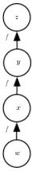
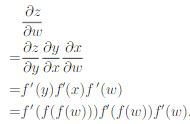

citation:
@book{Goodfellow-et-al-2016,
    title={Deep Learning},
    author={Ian Goodfellow and Yoshua Bengio and Aaron Courville},
    publisher={MIT Press},
    note={\url{http://www.deeplearningbook.org}},
    year={2016}
}

작성자:허영호
aozmfh34@gmail.com

# Deep FeedForward Networks
**Deep FeedForward Networks**은 **feedforward neural networks**와 **Multilayer Perceptrons**(**MLP**)라는 명칭을 사용하기도 하며, 주어진 입력값 X에 대한 결괏값 Y를 구하는 함수 *f* 를 계산할 때 사용된다. 예시로, Linear regression에서 y = *f*(x)라고 정의할 때, *f*(x)=*W*x+*b*이고, Feedforward Networks는 *W*의 값을 배움으로써 주어진 입력 x에 대한 알맞은 결괏값 y를 구할 수 있다. 

FeedForward라고 불리는 이유는 입력값 x로부터 함수 *f* 를 통해 결괏값 y로 나올 때 어떠한 정보들도 피드백(**Feedback**)되지 않기 때문이다. 만약 결괏값 Y가 함수 *f* 에 연결되거나 함수 *f* 자체 내에서 Feedback이 사용된 경우 **Recurrent Neural Networks**로 정의된다. 

또한, Deep으로 불리는 이유는 함수 *f* 에 들어가는 값이 입력값 x뿐만 아니라 함수 *f* 의 결괏값이 될 수 있기 때문이다. 예로,  함수처럼, 함수의 입력값이 다른 함수의 값이 되어 각 함수를 연결할 수 있다.

이러한 구조는 신경망에서 가장 많이 쓰이고 3단계의 계층(**Input Layer**, **Hidden Layer**, **Output Layer**)으로 정의할 수 있다. 예제에서, x는 입력값 계층(**Input layer**), $$f^{(1)}$$는 두 번째 계층, 는 세 번째 계층, 마지막 계층(y)은 결괏값 계층(**Output Layer**)이라 부른다. 이때 입력값 계층과 결괏값 계층 사이에 있는 계층들이 **Hidden Layer**이다.

### Linear vs. nonLinear
Linear 모델(linear Regession, Logistic Regression)은 닫힌 형태의 수식 또는 convex 형태의 그래프일 때 안정적이고 효과적인 결괏값을 구할 수 있지만, 일차 함수에서만 사용할 수 있고, 결국 linear 모델은 두 개의 입력값 사이의 관계를 이해할 수 없다는 단점을 가지고 있다. 이를 극복하기 위해 linear 모델에 입력값 x를 바로 대입하지 않고 x를 커널 함수(**Kernel function**) 에 대입하여 nonlinear로 변경 후 를 모델의 입력값으로 대입한다. 이 함수 를 nonlinear transformation이라 한다.

를 결정하는 3가지 방법이 존재한다:
1. **Radial Basis Function**(**RBF**) kernel과 같이 커널 기계에서 암묵적으로 사용하는 일반적인 함수를 사용한다. 이 함수의 차원이 크면 훈련 데이터(training set)를 전부 수용할 수 있지만, 실험 데이터(test set)에선 일반화가 제대로 이뤄지지 않는다. 이러한 함수들은 local Smoothness에만 기준을 두었기 때문에 과거의 정보를 충분히 내재하지 못하고 복잡한 문제를 해결하지 못하는 단점이 존재한다.

2. 다른 방법으론 개발자들이 직접 를 설계한다. Deep learning이 나오기 이전 기계학습에서 많은 개발자가 사용하던 방법이다. 각 분야의 전문가들이 를 직접 구현해야 하는 단점이 존재한다.

3. Deep Learning은 를 학습을 통해 배운다. 이를 수식으로 보면 으로 표현한다. 는 를 배울 때 사용되는 parameter이고 *w*는 에서 결괏값을 산출할 때 쓰이는 parameter이다. 딥 러닝에선 는 Hidden Layer라고 생각할 수 있다. 이러한 방법은 3가지 방법 중 유일하게 훈련 시 볼록한(convex) 그래프가 되지 않지만, 이를 통해 얻을 수 있는 이점이 더 크다. 를 학습을 통해 배우는 방법은 위에 서술한 두 가지 방법의 이점을 다 가지고 있다. 를 일반적인 함수(RBF)로 사용할 경우 첫 번째 방법과 유사하고, 개발자가 직접 를 구현하면 두 번째 방법과 유사하다. 두 번째 방법과 다른 점은 개발자가 정확한  함수를 정하지 않고 유사한 함수만 정해도 된다는 이점이 있다.

## Example: Learning XOR
FeedForward network를 좀 더 이해하기 쉽게 XOR 함수를 학습하는 과정을 설명하면서 위의 내용을 정리해 보자. XOR 함수는 두 개의 입력값이 서로 다를 때만 1을 반환하고 서로 다를 경우 0을 반환하는 함수이다.

입력값은 정리하면 이고 모델은 Linear 모델을 사용하여 으로 수식을 정의한다. loss/cost 함수는 Mean Square Error(MSE)를 사용하고 수식으로 다음과 같이 표현한다.

위의 모델에 입력값을 넣어 W와 b를 구하면 w = 0, b = 이 된다. 결국, 이 모델의 정확성은 0.5가 된다. 그 이유는 아래의 그림을 보면 알 수 있다.

AND와 OR의 경우 직선 하나로 두 개의 결괏값(0,1)을 구분할 수 있지만, XOR의 경우 직선 하나로 두 개의 결괏값을 구분할 수 없다. 직선 하나로 구분 시 0과 1이 모두 들어 있기 때문에 정확성이 0.5일 수밖에 없다. 이를 해결하기 위해 Hidden Layer 하나를 사용한 feedforward network를 구성해 보자. 이를 수식으로 표현하면 다음과 같다. 

Hidden Layer에서 산출한 값을 결괏값으로 표현하기 위해 Activation 함수가 필요하다. **Hyper Tangent**(**tanh**) 또는 **Rectified linear Unit**(**ReLU**)함수가 가장 많이 쓰인다. 이 예제에서는 ReLU를 사용해서 결괏값을 구하였다.

이제 만들어진 nonLinear 모델을 계산하여 결괏값이 정확한지 확인해보자.
각각의 wight와 bias를 정의하면 다음과 같다. b = 0이다.

먼저 *h*를 계산하면 

구한 값에 c를 더하면,

구한 *h*값을 Activation 함수 ReLU에 적용하면,

마지막으로 *ReLU*(*h*)에 *W*를 곱하면, 

모든 입력값의 결과가 제대로 나왔다. 단순 Linear에선 0.5의 정확성이었지만, Hidden Layer를 사용한 FeedForward Networks에선 100%의 정확성을 보여준다. 현실에선 위와 같이 정확한 *wight*와 *bias*값을 찾긴 불가능하지만, **Gradient Descent**를 사용하면 높은 정확성을 기대할 수 있다. 

## Gradient-based Learning
Linear 모델과 신경망 모델의 가장 큰 차이점은 신경망의 비선형(nonlinearity) 특징 때문에 cost 함수의 그래프가 convex 형태로 나타나지 않는다는 점이다. 결국, cost의 값이 매우 낮게 나오긴 하지만 linear 함수처럼 cost의 값이 0이 될 수는 없다. 또한, 신경망 모델에선 초기 parameter 값이 최종 결괏값에 큰 영향을 미침으로 초깃값 설정을 알맞게 설정해야 한다. 기본적으로 FeedForward Networks에선 weight 값은 작은 무작위 값으로 설정하고 bias의 값은 0 또는 낮은 값으로 설정한다.

### Cost 함수
Deep 신경망에선 어떤 cost 함수를 사용하는지가 중요하다. 다행히도 신경망에서 사용되는 cost 함수는 linear 모델이나 다른 parameter를 사용하는 모델이 사용하는 cost 함수와 유사하거나 같다. 대부분 입력값에 대한 결괏값의 확률분포를 정하고 최대가능도(Maximum likelihood) 원리를 사용하여 계산한다. 또한, 좀 더 쉽게 계산하는 방법으로 결괏값의 전체 확률 분포를 계산해서 결괏값에 대한 입력값 조건부 확률을 계산하기도 한다.

#### 최대가능도(Maximum likelihood)를 사용한 조건부 분포도(Conditional Distribution) 학습
현대 대부분의 신경망은 최대가능도 조건부확률을 사용하여 훈련한다. 최대가능도 조건불 확률을 간단히 설명하면 negative log-likelihood로 표현할 수 있다. 익숙한 표현으론 negative cross-entropy이다. 수식으로 표현하면,

두 가지 예로, Mean Square Error cost를 적용하면, 

이때 const는 Gaussian 분포도에 따라 변하며 분수 또한 에 영향을 받지 않아, 위의 식과 같다고 볼 수 있다.

Logistic regression의 cost 함수 또한 최대가능도를 활용한 함수이다:

최대가능도를 사용한 cost 함수의 장점은 각각의 모델에 맞춘 cost 함수를 만들 필요성이 사라지는 것이다. 모델의 *P*(*y*|*x*)만 정해주면 cost 함수로 바로 적용할 수 있다. 또한, log 함수를 사용함으로써 지수함수(exponential function)를 사용한 결괏값 산출에서 발생하는 vanishing gradient 문제를 해결할 수 있다.

#### 조건부 통계(Conditional Statistics) 학습
주어진 입력값으로 결괏값의 조건부 통계를 알고 싶을 때 사용되는 방법을 설명한다. 예를 들어 입력값 하나를 주어졌을 때 결괏값의 평균을 구하고자 할 때가 있다. 특정한 특징을 parameter로 사용하는 것이 아닌 연속성(continuity) 또는 경계(boundedness)와 같은 특징을 사용하여 신경망의 cost 함수가 범함수(**Functional**)의 역할을 하는 방식으로 생각할 수 있다. 정리하면, 범함수란 함수로부터 실제값을 구하는 함수로 생각할 수 있고 딥 러닝에서 parameter를 선택해 학습하는 개념이 아닌 함수를 선택해 학습하는 개념으로 생각할 수 있다. cost 범함수를 설계할 때 cost의 값이 우리가 원하는 특정 함수일 때 최소가 될 수 있도록 한다. 최적화 문제(optimization)를 해결하기 위해선 변분법(**Calculus of variations**)가 필요하다. 아래에서 두 가지 최적화 방법을 설명하겠다.

* 각 입력값 x로 결괏값의 평균을 예측하는 함수를 구하는 방법

또는 

위의 식으로 표현되며, mean squared error cost 함수를 최소화하면 각 입력값 x에 대한 y의 평균값을 예측하는 함수가 된다.

* 각 입력값 x로 결괏값의 중앙값(median)을 예측하는 함수를 구하는 방법

위의 식은 각 입력값 x에 대한 결괏값 y의 중앙값을 예측하는 함수이다. 이 cost 함수는 **mean absolute error**라 부른다.

불행히도, mean square error와 mean absolute error는 gradient-based 최적화시 안 좋은 결과를 나타낸다. 이유는 이 두 가지의 cost 함수를 사용 시 output units에서 gradients가 너무 작게 생성되어 학습이 제대로 이뤄지지 않는다. 그래서 *P*(y|x)의 전체 분포도가 필요하지 않은 상황에서도 위의 두 cost 함수보단 cross-entropy cost 함수를 더 많이 사용한다.

### 결괏값 유닛 (Output Unit)
cost 함수를 정하는 것은 output unit을 정하는 것과 상당히 밀접한 관계가 있다. 보통, 데이터 분포도와 모델 분포도를 가지고 cross-entropy 함수를 사용하여 cost 값을 구하고, 결괏값을 어떻게 표현하느냐에 따라 cross-entropy 함수의 유형이 정해진다. Layer를 설명 할 때도 언급했듯이, hidden unit이 output unit이 될 수 있고 output unit이 hidden unit이 될 수 있다. 

#### 가우시안 분포를 사용한 Linear Unit
Linear output layer는 대부분 조건부 가우시안 분포도의 평균(conditional Gaussian distribution)을 나타낸다. log-likelihood를 최대화를 시킨 값은 mean squared error를 최소화한 값이랑 일치하고 최대가능도를 사용해서 가우시안의 공분산(covariance)를 구할 수 있다. 하지만, 공분산은 모든 입력값이 양수 matrix에 정의되어야 하는 제한이 있다. 이러한 한계를 극복하기 위해 다른 output unit으로 공분산을 parameter로 적용한다. 또한, linear unit은 gradient를 작게 만들지 않기 때문에 여러 최적화 알고리즘과 사용 할 수 있는 장점이 있다.

#### Bernoulli 분포를 사용한 Sigmoid Unit
결괏값을 이진법으로 나타낼 때 또는 Classification 문제를 해결하기 위해 사용된다.  Bernoulli 분포를 사용하면 신경만은 오직 *P*(y = 1 | x)만 구하면 된다. 또한, 이 확률이 알맞은 값이 되기 위해선 [0,1] 사이의 값이어야만 한다. 만약 Linear unit을 사용한 경우 아래와 같은 식을 쓰고,

조건부 분도포(conditional distribution)에는 알맞지만, 실제 훈련 시 gradient descent가 제대로 작동하지 않는다. 그 이유는 *wx*+*c*의 값이 [0,1] 사이의 값에서 벗어나면 gradient는 0으로 변하게 되고, gradient가 0일 때 학습 알고리즘은 더 나은 parameter를 선택할 수 없는 상황이 되어버린다. 따라서, Linear unit을 사용하기보단 Sigmoid unit을 사용하여 알맞은 답이 아닐 시 gradient를 크게 만들어 학습을 시킬 수 있도록 하는 방법을 사용한다. 

sigmoid unit을 적용하는 방법은 linear layer가 *z* = *wx* + *b*를 구한 후 *z*를 sigmoid unit에 대입하여 확률 을 구하는 방식으로 구해진 확률의 총값은 1을 초과하지만, 이 확률들을 적절한 상수로 나누면 총합이 1인 확률이 구해진다. 수식으로 다음과 같이 표현한다.

위의 수식에서 *z*는 *logit*이라 불린다. 또한, 위의 수식에선 exponential을 사용하므로 최대가능도(maximum likelihood)를 사용하면 cost 함수 -log*P*(y|x) 안에 포함된 log가 sigmoid 안에 포함된 exponential을 상쇄시켜 gradient-based 학습에 적합하다. Maximum likelihood cost 함수를 sigmoid에 적용하면 다음과 같다.

위의 식에 SoftPlus 함수를 적용하면,

where, 

결국, (1-2y)z 값이 큰 음수가 될 시 cost의 값이 0에 가까워지고 다르게 설명하면 예측한 값이 알맞은 값일 때만 cost의 값이 0에 가까워 짐으로서 학습에 성공 할 수 있다. 또한, 다른 cost 함수를 사용 시 결국 sigmoid(z)의 값이 큰 음수일 때만 cost의 값도 0에 가까워지고 큰 양수 일 시 1에 가까워지는 방법으로 학습에 성공할 수 있고 이러한 이유에서 maximum likelihood를 sigmoid Unit에 사용하는 것을 선호한다.

마지막으로, 실제 구현 시, 0과 1을 포함[0,1]하는 범위 대신 0과 1을 포함하지 않는 (0,1) 범위를 설정해야 한다. 만약 sigmoid 함수가 0이 되어 버리면, 알고리즘은 음수 무한대의 값이 되기 때문에 계산에 문제가 발생한다.

#### Multinoulli 분포를 사용한 Softmax Unit
Softmax unit은 *n*개의 discrete 변수의 확률 분포를 구할 때 사용된다. 위에서 설명한 sigmoid unit의 일반화된 방법이라 생각할 수 있다. Softmax에서 분류한 각 개채 안에서 소분류가 필요하면 Softmax unit 안에 Softmax unit을 포함할 수 있다.

Sigmoid unit에서는 y = *P*(y =1 | x)이면, Softmax Unit에선 아래와 같이 표현한다.

 
 
위의 식에서 각각의 y의 값은 0과 1 사이의 값이어야 하며, 총합이 1이 되어야 한다. 먼저 Sigmoid unit과 같이 linear layer를 사용하여 *z*값을 구한 후,

 where

Softmax 함수에 *z*를 대입하여 원하는 y의 값을 산출한다.

Logistic sigmoid에서 maximum log-likelihood를 사용할 시 학습이 잘 이루어 진 것처럼, softmax에서도 maximum log-likelihood를 사용하면, softmax에 포함된 exponential을 log로 상쇄시켜 학습이 잘 이루어진다. 

첫 변수 z는 cost 함수에 직접적인 영향을 미치고 값이 줄어들지 않기 때문에 두 번째 변수가 아무리 작은 수가 되어도 학습할 수 있다. 위의 수식을 생각해보면, 두 번째 변수인 는 와 거의 같다고 생각할 수 있다. 그 이유는 z의 최댓값 보다 확실히 작은 x의 값을 exponential에 대입 시 exp(x)값은 의미가 없어진다. 따라서, 틀린 예상 값을 구했을시 두 번째 변수는 의미가 없어지며, 첫 번째 변수 z만 남으면서 cost 값이 커진다. 반대로, 알맞은 예상 값을 구했을 시 첫 번째 변수인 z와 두 번째 변수인 가 서로 상쇄되어 cost 값이 낮아진다. 

maximum likelihood는 consistent estimator이기 때문에, 모델이 훈련 분포를 전부 수용할 수만 있다면, 적확한 계산이 가능하지만, 실제 구현 시 모델의 수용도의 한계와 불완전한 optimization 때문에 정확한 값이 아닌 비슷하거나 유사한 값이 산출된다.

또한, log-likelihood가 아닌 다른 방식의 함수(squared error)를 적용 시 softmax안에 포함된 exponential을 상쇄시키지 못하게 되고 vanishing gradient로 인해 훈련이 제대로 이루어지지 않는다.

### Hidden Units
Hidden units을 설계하는 방법은 학계에서 활발히 연구 중이고 아직 학문적으로 완벽한 설계가 없다. ReLu를 많이 사용하긴 하지만, 다른 unit들도 많고 어떠한 상황에서 어떤 unit을 사용할지 정해진 기준이 없다. 실제 적용 시 어떤 unit이 좋은 결과를 나타낼지 예상할 수 없다. 

또한, 몇몇 hidden unit은 모든 입력값에 대해 이론적으로 미분을 할 수 없지만, 실제 적용 시 학습에 문제가 되지 않는다. 예를 들어, ReLu, g(x) = [0,x], 0에서 미분이 불가능하지만 실제 훈련 알고리즘에선 정확히 local minimum에 도달하길 기대하지 않고, 유사한 값에 머물기 때문에 기울기가 0이 되지 않는다. 이론적으론 왼쪽 기울기와 오른쪽 기울기가 같아야 미분할 수 있다고 정의한다. ReLu에선 왼쪽 기울기는 0 오른쪽 기울기는 1이 되며, 이론적으로 미분이 불가능하다고 정의되지만, g(0) 이 될 시 실제값이 0이 아닌 0에 근접한 작은 소수를 내림 값으로 표현해 0으로 표기된다.

대부분의 Hidden Unit은 입력값 x를 받아서 z = *Wx* + *b*를 계산 후 nonlinear 함수 g(z)를 적용 한 값을 다른 계층으로 보낸다. Hidden unit을 구분하는 방법은 어떤 g(x) 함수를 쓰냐에 따라 달라진다.

#### Rectified linear Unit(ReLu)
ReLu의 수식은 g(x) =  max{0, x}이고 Linear 함수와 유사하기 때문에 optimization을 하기 쉽다. 차이점은 linear 함수는 결괏값이 음수 무한대부터 양수 무한대까지이지만, ReLu는 0부터 양수 무한대까지여서 이 unit이 활성화되어 있을시 큰 값이 유지된다. 

ReLu의 약점으로는 activation이 0일 경우 학습이 되지 않는다. 이를 해결하기 위해 여러 generalization은 gradient가 0이 되지 않게 설정한다. 세 가지 예로, z < 0: h = g(z,a) = max(0,z) + amin(0,z)일 때, **Absolute value Rectification**은 a = -1로 정해서 g(z) = |z|가 될 수 있도록 하였고. **Leaky ReLu**는 a를 작은 소수, 0.01,로 고정하여 0보다 작은 수가 될 수 있도록 하였고, **Parametric Relu** 또는 **PReLu**는 a를 학습시키는 방법을 사용하여 generalization을 하였다.

**Maxout unit**은 위의 세 가지 예시처럼 g(z)를 generalization을 하기보단, z를 k 그룹으로 나누어 각각의 maxout unit이 각 k 그룹에서의 최댓값을 결괏값으로 나타낸다. 대표적인 예로, Convolutional Networks에서 Max-Pooling layer로 쓰인다. Maxout unit은 정확한 linear and convex 함수를 학습할 수 있으며, units간의 관계를 배우기보단, activation 함수 자체를 학습하는 개념이다. 일반적으론 입력값을 한 개의 hidden layer를 통해 결괏값을 산출 하지만, Maxout unit은 두 개의 계층을 사용한다: affine과 maxout. Affine function은 activation function이 존재하기보단, 입력값에 각각의 weight를 곱한 후 더하는 형식이고, maxout function은 affine의 출력값들 중 가장 큰 수를 결괏값으로 나타낸다. 

maxout unit은 k 개수의 weight를 사용하므로 generalization이 더 필요하지만, training set이 많고 각 unit당 입력 개수가 작을 경우 generalization을 하지 않아도 잘 작동된다. 또한, maxout시 계산된 결과의 최댓값을 그대로 가져오기 때문에 과거에 훈련했던 정보를 잊어버리는**catastrophic forgetting** 효과를 제거할 수 있다.

#### Logistic Sigmoid와 Hyperbolic Tangent(tanh)
Logistic Sigmoid는 ReLu를 사용하기 이전에 가장 많이 쓰였던 activation 함수이다. Hyerboli tangent도 logistic sigmoid와 밀접한 관계가 있다: tanh(x) = 2sigmoid(2z) - 1. 앞서 본 것처럼 sigmoid는 z 값이 큰 양수일 경우 산출된 값도 커지고 z 값이 큰 음수일 경우 산출된 값이 작아진다. 또한, z 값이 0 근처일 경우에만 결괏값에 큰 영향이 있다. z 값에 따라 크게 변하는 결괏값 때문에 hidden 계층 안에서 sigmoid를 쓰는 걸 권하지 않는다. Sigmoid와 같은 함수가 꼭 필요한 상황일 경우 tanh을 사용하는 것이 더 효과적이다. 

### Other Hidden Unit
미분이 가능한 함수를 hidden unit으로 쓸 경우 대부분 좋은 결괏값을 보여준다. 예로, cos 함수를 사용해서 hidden layer를 설계하여, h = cos(*Wx* + *b*), MINIST데이터를 학습시켜본 결과 적확성이 99% 이상의 정확성을 보여주었다. 이처럼 다양한 함수를 hidden layer에서 사용할 수 있지만, 논문에 서술되지 않은 이유는, 새로운 함수를 사용 시 이전보다 크게 성능 향상을 보이지 않으면 크게 관심을 받지 못하기 때문이다. 위의 세 가지 함수보단 덜 쓰이지만 흔한 함수를 소개하겠다.

* **Radial basis function**

위의 수식으로 표현하며, x가 w 값과 비슷해지는 경우 활성화되며, 대부분의 x의 값에 대해 0을 반환하므로 optimization이 힘들다.

* **SoftPlus**

위의 수식으로 표현하며, ReLu의 순화된 함수로 생각할 수 있다. 하지만 ReLu가 더 성능이 좋다는 연구 결과에 따라 SoftPlus는 잘 사용되지 않는다.

* **Hard Tanh**

위의 수식으로 표현하며, tanh와 유사하지만, 경계가 다르다.

### Architecture(구조) 설계
신경망에서 구조란 몇 개의 Hidden Unit을 사용하고 이 Unit들을 서로 연결하는 방법을 뜻한다. 대부분의 신경망에서 이 Unit들을 계칭이라 칭하며 각각의 계층은 함수로 표현된다. 예시로, 첫 번째 계층은 다음과 같이 표현하며,

첫 번째 계층과 두 번째 계층을 연결하면 다음과 같이 표현한다.

하나의 계층 안에 있는 Unit의 개수가 구조의 넓이(width)라 칭하며, Hidden layer의 개수가 깊이(depth)라 칭한다. 구조설계에서 깊이와 넓이가 것이 중요 고려대상이다. 신경망이 깊어질수록 각 계층당 unit의 개수와 특징 개수가 감소할 수 있지만, 최적화하기 힘든 문제점이 있다. 현재는 실험을 통해 validation set의 오류율에 따라 직접 확인해야 한다.

#### Universal Approximation Properties and Depth
Linear 모델의 많은 cost 함수들이 대체로 convex 하기 때문에 학습시키기 쉽지만, linear 함수로만 표현할 수 있다. nonlinear 함수를 학습시키기 위해선 각 함수에 맞는 특별한 모델을 설계해야 하지만, **universal approximation theorem**에 의하면 linear한 output 계층과 활성 함수가 포함된 하나의 hidden 계층을 가지고 있는 feedforward network는 Borel 함수를 예측할 수 있다고 정의한다. Borel 함수란 bounded 되고 닫힌 형태의 Continuous 함수를 칭한다. 또한, feedforward network의 미분 값이 함수의 미분 값을 예측할 수 있다. 

universal approximation theorem에서는 학습시키고 싶은 어떠한 함수라도 큰 MLP가 이러한 함수들을 표현할 수 있다고 설명한다. 하지만, 학습 알고리즘이 이러한 함수를 학습할 수 있다고 장담할 수 없다. 두 가지 이유로, 학습 시 사용한 optimization 알고리즘이 원하는 parameter의 값을 찾을 수 없을 수도 있고 두 번째로, overfitting으로 인해 학습 알고리즘이 알맞은 함수를 찾지 못할 수 있다. 

정리하면, 하나의 계층을 가지고 있는 feedforwd network는 어떠한 함수도 표현할 수 있지만, 이 계층이 수용할 수 없을 정도로 클 수도 있기 때문에 학습이 실패할 수 있다. 대부분 상황에서는 깊이를 증가시켜 각 계층의 unit 개수를 줄여 학습을 진행할 수 있다.

#### Other Architectural Considerations
위에선 신경망의 깊이와 넓이를 고려대상으로 정하였지만, 다른 고려대상으론 각 계층들을 어떻게 연결하는지도 생각해야 한다. Convolutional networks와 Recurrent networks처럼 chain 연결 방식이 아닌 구조도 생각해보아야 한다. 

### Back-Propagation and other differentiation algorithms
지금까지 입력값 x를 대입하여 hidden 계층을 거쳐 결괏값 y를 구하는 **Forward propagation**을 사용했다. **Back-Propagation algorithms**은 cost 값으로 부터 반대로 입력값까지 뒤로 계산하면서 gradient를 계산하는 알고리즘이다. 흔히 Back-Propagation을 학습 알고리즘으로 잘못 이해하는 경우가 많다. 정확히는 학습 알고리즘보단 gradient를 계산하는 방법이고 stochastic gradient descent와 같은 알고리즘이 gradient를 학습하는 알고리즘이다. 또한, back-propagation이 다층 신경망 구조에서만 사용되는 방법이라 잘못 이해하는 경우도 있지만, 다층 신경망에서만 쓰이는 것이 아닌 모든 함수에 사용될 수 있다.

#### Computational Graph
대체로 신경망은 graph 적인 방식으로 표현한다. graph란 노드(node)와 노드를 연결하는 구조로 표현하는데, 신경망에서의 노드는 variable로 생각할 수 있다. 이 variable은 상수, vector, tensor, matrix 또는 다른 값이 될 수 있다. 또한, opertion이라는 표현을 사용하는데. operation이란 한 개 또는 여러 개의 variable을 대입시키는 함수이다. 전반적인 관점에서 computational graph를 보면, 입력값 노드에서 operation 노드로 입력값을 대입시켜 나온 결괏값을 결괏값 노드에 저장 한다고 생각할 수 있다. 

#### Chain Rule of Calculus
Chain rule of calculus란 다른 함수의 미분 값이 포함된 함수의 미분을 하는 방법이다. 이때 다른 함수의 미분 값은 이미 알고 있다. 예를 들어, y = g(x)와  z = f(g(x)) = f(y)라고 가정할 때, z에 대한 x의 미분 값으로 다음과 같이 표현한다.

위의 식에서 는 y=g(x)로 쉽게 구할 수 있으며 또한 z=f(y)를 통해 미분 값을 구한 후 두 미분 값을 서로 곱하여 chain rule을 사용 하지 않았을 때 계산하기 힘든 의 값을 쉽게 구할 수 있다.
#### Recursively Applying the Chain Rule to obtain Back-Propagation
쉽게 이해하기 위해 예시로 설명하겠다. 다음과 같은 graph를 보면,

 

위의 graph에서 chain rule을 적용하여 미분 값을 구하려면 옆과 같은 수식이 만들어진다.

#### Symbol-to-Symbol Derivatives
Symbol-to-Symbol은 특정한 값이 정해지지 않은 변수를 뜻한다. 이러한 변수를 미분하는 것을 Symbol-to-Symbol derivatives라고 칭한다. 아래의 그림을 보면 이해하기 쉽다.

